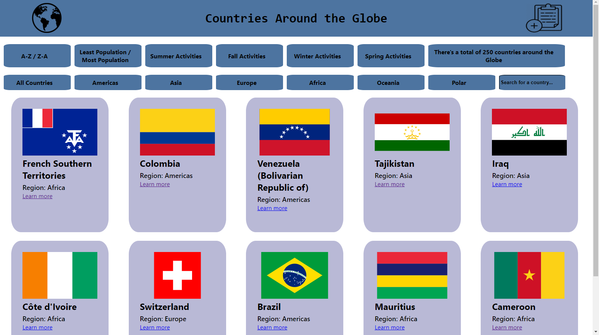
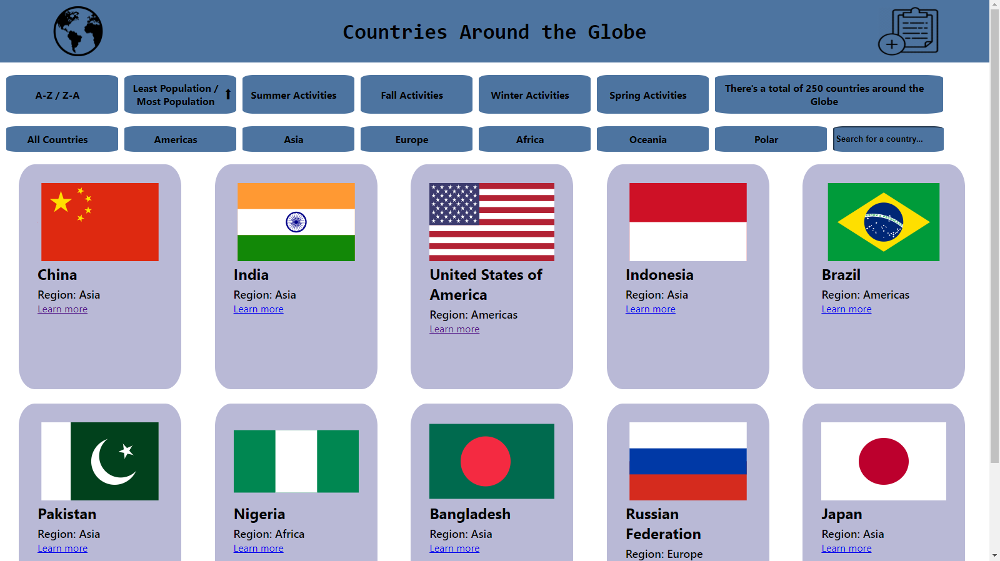

# Countries Around The World

  

## Technologies used to build this App.

- Frontend: React, JavaScript.
- Backend: NodeJS, ExpressJS, Sequelize
- Designs: CSS
- Database: PostgreSQL

## What you can do.
 Search for a country, sort them from A-Z, Z-A, by Population or Filter by Region or Activity Season.

  

 Want to see the top 10 countries with the most population? Just sort them.
 

  

 You can add your own activities and include them in all the countries you want.
 

  

  

## Deploy Coming Soon!!!.